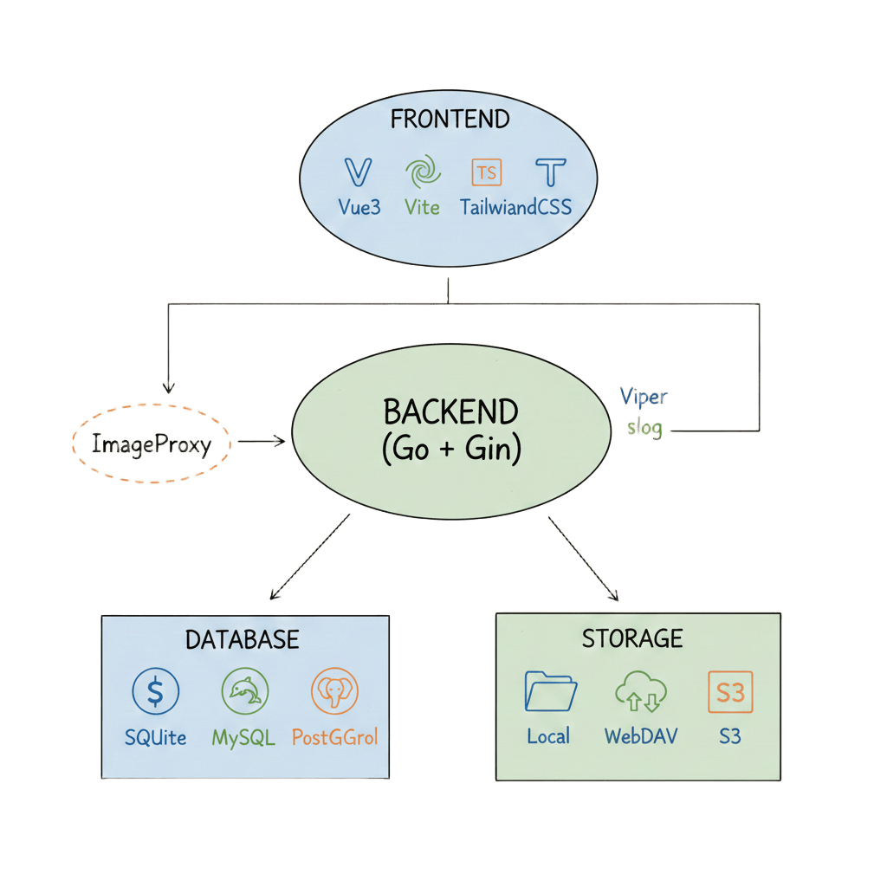

# Love Girl

> 一个为情侣设计的全栈应用，记录美好时光，珍藏珍贵回忆

[](https://golang.org)
[](https://vuejs.org)
[](LICENSE)

## ✨ 特性

- 🎨 **现代化界面** - 基于 Vue 3 + TypeScript 构建的精美前端
- 🔒 **安全认证** - JWT 令牌认证，保障数据安全
- 💾 **多种存储** - 支持本地存储、S3、WebDAV 等多种存储后端
- 🔥 **热更新** - 配置文件修改后自动热更新，零停机重启
- 📦 **容器化** - 提供 Docker 部署方案，一键部署
- 🌐 **响应式设计** - 完美适配桌面和移动设备

## 🏗️ 技术架构



### 前端技术栈

- **核心框架**: Vue 3.5 + TypeScript + Vite + Pinia + Vue Router
- **样式方案**: TailwindCSS 4
- **HTTP 客户端**: Axios
- **视觉媒体**: vue-easy-lightbox + p5.js + vue3-lottie
- **日期相关**: chinese-days
- **地图**: Leaflet

### 后端技术栈

- **Web 框架**: Gin - 高性能 HTTP Web 框架
- **数据库 ORM**: GORM - 功能强大的 ORM 库
- **配置管理**: Viper - 配置文件解析和管理
- **优雅重启**: fvbock/endless - 零停机重启
- **认证**: JWT - JSON Web Token 认证

### 核心特性实现

#### 🔥 配置热更新

基于 Gin + Viper 的自动化配置管理架构：

1. **静态初始化** - 自动创建默认配置文件
2. **热监听** - Viper 监听配置文件变化
3. **原子校验** - 变更前进行语法和业务验证
4. **零停机重启** - Endless 实现 FD 继承和优雅重启

详细架构设计请参考：[配置文档](docs/config.md)

#### 💾 灵活的存储方案

支持多种存储后端，可根据需求选择：

- **本地存储** - 适合开发和单机部署
- **S3 存储** - 支持兼容 S3 协议的对象存储
- **WebDAV 存储** - 支持 WebDAV 协议的网盘服务

## 📚 文档

- [代码库指南](AGENTS.md) - 开发环境搭建、代码规范、调试技巧和常见问题
- [配置文档](docs/config.md) - 详细的配置项说明和技术架构

## 🚀 快速开始

### 环境要求

- Go 1.25+
- Node.js 24+
- SQLite / MySQL / PostgreSQL

详细的开发指南请参考：[代码库指南](AGENTS.md)

### Docker 部署

#### 使用 docker run 命令

```bash
docker run -d \
  --name love-girl \
  -p 8181:8181 \
  -v $(pwd)/data:/app/data \
  -e TZ=Asia/Shanghai \
  -e SERVER_SCHEMA=https \
  -e SERVER_HOST_NAME=example.com:8181 \
  -e DATASOURCE_DATABASE_DRIVER=sqlite \
  -e DATASOURCE_DATABASE_DSN=file:./data/love-girl.db?_fk=1 \
  -e STORAGE_BACKEND=local \
  -e STORAGE_LOCAL_ROOT=./data/uploads \
  --restart unless-stopped \
  bookandmusic/love-girl:latest
```

#### 使用 docker-compose

```yaml
services:
  app:
    image: bookandmusic/love-girl:latest
    container_name: love-girl
    ports:
      - "8181:8181"
    volumes:
      - ./data:/app/data
    restart: unless-stopped
    environment:
      - TZ=Asia/Shanghai
      - SERVER_SCHEMA=https
      - SERVER_HOST_NAME=example.com:8181
      - DATASOURCE_DATABASE_DRIVER=sqlite
      - DATASOURCE_DATABASE_DSN=file:./data/love-girl.db?_fk=1
      - STORAGE_BACKEND=local
      - STORAGE_LOCAL_ROOT=./data/uploads
```

## ⚙️ 配置说明

完整配置项请参考：[配置文档](docs/config.md)

### 核心配置


| 配置项                       | 说明             | 默认值                |
| ---------------------------- | ---------------- | --------------------- |
| `SERVER_ADDR`                | 服务监听地址     | `:8182`               |
| `DATASOURCE_DATABASE_DRIVER` | 数据库类型       | `sqlite`              |
| `DATASOURCE_DATABASE_DSN`    | 数据库连接字符串 | `./data/love-girl.db` |
| `STORAGE_BACKEND`            | 存储后端类型     | `local`               |
| `STORAGE_LOCAL_ROOT`         | 本地存储路径     | `./data/uploads`      |

### 数据持久化

数据将挂载到 `./data` 目录，包含：

- SQLite 数据库文件
- 用户上传的文件（头像、图片等）

### 配置热更新

修改 `./data/configs/config.yaml` 后，系统会自动：

1. 检测配置文件变更
2. 验证配置的有效性
3. 零停机重启服务，应用新配置

## 🤝 贡献

欢迎贡献代码、报告问题或提出建议！

## 📄 许可证

[MIT License](LICENSE)

## ⭐ Star History

[](https://star-history.com/#bookandmusic/love-girl&Date)

---

Made with ❤️ for couples
